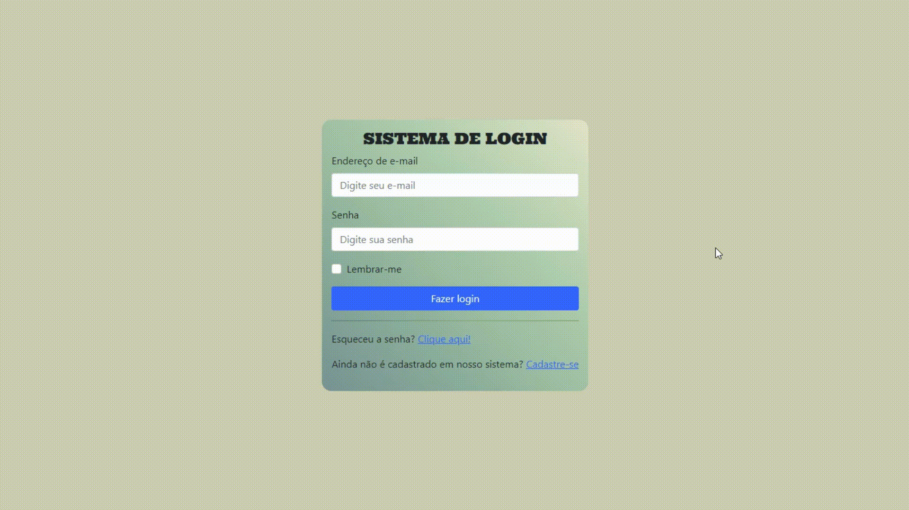

# Sistema-Login-PHP 🔐
Fala pessoal, tudo bem?🖖🏽 Esse projeto foi desenvolvido durante as aulas da faculdade no módulo - PROGRAMAÇÃO PARA WEB EM AMBIENTE LIVRE.

## # Sobre o projeto 📚

O projeto é um sistema de login de acesso desenvolvido em PHP(<a href="https://windows.php.net/download/">v7.4.19</a>), utilizando o banco de dados MySQL com as seguintes diretrizes:

- O usuário cria seu cadastro, contendo os campos: nome, e-mail e senha;
- O sistema possui um setor de "Conteúdo Exclusivo", que o usuário só poderá acessar após fazer o seu
cadastro completo e logar no sistema;
- O banco de dados contém um único endereço de e-mail, se houver a tentativa de cadastro em
duplicidade, o usuário é informado;
- Segurança: a senha contém criptografia <a href="https://www.php.net/manual/pt_BR/function.password-hash.php">Hash</a>; e
- Caso o usuário esqueça sua senha, o sistema tem a opção para o envio de uma nova senha por e-mail.

O projeto original foi desenvolvido utilizando HTML/CSS básico, onde tomei a liberdade e inclui o framework web <a href="https://getbootstrap.com/">Bootstrap(v5.1.3)</a>, e fiz uma pequena estilização dos componentes.

<div class="center">
  
</div>
  
## # Tecnologias utilizadas ⚙
<div>
 
 
 
 
    
 
  
</div>
  
## # Executando o projeto 🚀
- Clone o repositório:
```bash
 git clone https://github.com/RodrigoooSC/Sistema-Login-PHP.git
```
- Crie o banco de dados, a tabela e os campos:
```
CREATE DATABASE empresax;

USE empresax;

CREATE TABLE IF NOT EXISTS tblusuario (
id_tblusuario int NOT NULL AUTO_INCREMENT,
nome_tblusuario varchar(150) NOT NULL,
email_tblusuario varchar(150) NOT NULL,
senha_tblusuario LONGTEXT NOT NULL,
UNIQUE (email_tblusuario),
PRIMARY KEY (id_tblusuario)
);
```
- Caso seja necessário modifique o arquivo 'config.php' com as credencias do seu bd:
```
define('DB_NAME', 'empresax');

define('DB_USER', 'root');

define('DB_PASSWORD', 'sua senha aqui');

define('DB_HOST', 'localhost');
```
- Abra um terminal na pasta raiz do projeto e execute a aplicação:
```
php -S localhost:8080
```


